# Design Token Architecture & Guidelines

This document serves as the single source of truth for the visual design system of the **Artifact Dashboard**, aligned with SEI brand guidelines and institutional UX patterns from sister projects **Stratos** and **DataVision**.

---

## 1. Two-Layer Token Architecture

The design token system follows a strict two-layer architecture separating **Raw Brand Primitives** (Layer 1) from **Semantic Application Tokens** (Layer 2).

```mermaid
flowchart LR
    subgraph L1["Layer 1: Brand Primitives"]
        Navy["Navy (#082340)"]
        Coral["Coral (#f15840)"]
        Green["Green (#089f6a)"]
        Blue["Blue (#5f8ac7)"]
        SEIC["SEI Primary & Neutrals"]
    end

    subgraph L2["Layer 2: Semantic Auto-Flipping Tokens"]
        Bg["--bg-page / page"]
        Surface["--surface / surface"]
        Text["--text-primary / ink-primary"]
        Action["--action-primary / action-primary"]
        Status["--status-* / status-*"]
    end

    subgraph UI["UI Components"]
        Cards["HeaderBar / StatCard"]
        Editors["PromptEditor / Monaco"]
        Badges["StatusBadge / FilterChip"]
    end

    L1 --> L2
    L2 --> UI
```



---

## 2. Layer 1: Brand & Institutional Palettes

### Stratos & DataVision Institutional Palette
| Token | Hex / Value | Description |
| :--- | :--- | :--- |
| `brand-navy` | `#082340` | Deep Institutional Navy, Primary Surface Header & Dark Contrast |
| `brand-navy-dark` | `#041324` | Midnight Navy background / deep modal layer |
| `brand-navy-light` | `#14385f` | Interactive Navy Hover State |
| `brand-coral` | `#f15840` | Primary Accent / CTA / Highlights |
| `brand-coral-alert`| `#e06d53` | Alert / Destructive Accent |
| `brand-green` | `#089f6a` | Success & Validated status |
| `brand-blue` | `#5f8ac7` | Info & Pipeline Active indicators |
| `brand-black` | `#141414` | High-contrast Typography |
| `brand-grey` | `#5a5a5a` | Secondary Typography & Neutral Borders |
| `brand-grey-light`| `#94a3b8` | Muted Text & Disabled Elements |

### SEI Corporate Palette
| Family | Hex | Shading Variants Available |
| :--- | :--- | :--- |
| **SEI Blue** | `#00c0f3` | `lighter: #c7eafb`, `light: #8ed8f8`, `dark: #0094c1`, `foundational: #005776` |
| **SEI Red** | `#d82b2a` | `lighter: #ffa6bf`, `light: #ff6680`, `dark: #d90000`, `foundational: #990000` |
| **SEI Green** | `#a6ce39` | `lighter: #e5edb2`, `light: #d3e27e`, `dark: #65ab3d`, `foundational: #007733` |
| **SEI Yellow** | `#ffdd00` | `lighter: #fff3b5`, `light: #ffea82`, `dark: #ecbc09`, `foundational: #ce9810` |
| **SEI Orange** | `#faa519` | `lighter: #ffe0ad`, `light: #fdc578`, `dark: #e87b1e`, `foundational: #c74a1b` |
| **SEI Pink** | `#f287b7` | `lighter: #fad5e5`, `light: #f7b7d3`, `dark: #d95293`, `foundational: #a0386c` |
| **SEI Gray** | `#c7c8ca` | `lighter: #f1f2f2`, `light: #e6e7e8`, `dark: #939598`, `darker: #58595b` |
| **SEI Navy** | `#254a5d` | `light: #c3ccd2`, `medium: #57728b`, `DEFAULT: #254a5d` |

---

## 3. Layer 2: Semantic Auto-Flipping Tokens

Tokens dynamically switch values between Light and Dark mode using CSS variables.

| Semantic Token | Light Mode Value | Dark Mode Value | Usage |
| :--- | :--- | :--- | :--- |
| `--bg-page` | `#f8fafc` | `#081626` | App background |
| `--surface` | `#ffffff` | `#0c2038` | Base cards, modals, dropdowns |
| `--surface-hover` | `#f1f5f9` | `#132d4e` | Interactive row & button hover |
| `--surface-border`| `rgba(8, 35, 64, 0.1)` | `rgba(255, 255, 255, 0.1)` | Subtle structural separators |
| `--text-primary` | `#141414` | `#f8fafc` | Primary titles, body text |
| `--text-secondary`| `#5a5a5a` | `#cbd5e1` | Descriptions, metadata, subheadings |
| `--text-muted` | `#94a3b8` | `#64748b` | Timestamps, placeholders, hints |
| `--text-brand` | `#082340` | `#38bdf8` | High-emphasis institutional headers |
| `--action-primary`| `#082340` | `#00c0f3` | Primary action buttons |
| `--action-secondary`| `#f15840` | `#f15840` | Secondary buttons & highlights |
| `--action-accent` | `#00c0f3` | `#34d399` | Focus indicators, active tabs |
| `--border-input` | `rgba(8, 35, 64, 0.18)` | `rgba(255, 255, 255, 0.18)` | Form fields, code editor frames |

### Status Colors (Alpha-aware)
- **Success (`published` / `valid`)**: Green (`#10b981` / `#34d399`)
- **Warning (`pending` / `warning`)**: Amber (`#f59e0b` / `#fbbf24`)
- **Error (`error` / `invalid`)**: Coral / Red (`#e06d53` / `#f87171`)
- **Info (`info` / `extracting`)**: Blue (`#5f8ac7` / `#38bdf8`)
- **Neutral (`draft` / `archived`)**: Slate Gray (`#64748b` / `#94a3b8`)

---

## 4. Typography & Radii

### Typography
- **Sans Serif**: `Inter, -apple-system, BlinkMacSystemFont, "Segoe UI", Roboto, sans-serif`
  - Used for all UI shells, tables, badges, headers, and metadata.
- **Monospace**: `JetBrains Mono, ui-monospace, Menlo, Monaco, Consolas, monospace`
  - Used for Stage 1 / Stage 2 Prompts, JSON Schemas, Few-shot Examples, and Version Hashes.

### Corner Radii (Levels)
- `level1` (`6px`): Small badges, code chips, buttons, inputs.
- `level2` (`12px`): Cards, tab containers, modals, table containers.
- `level3` (`18px`): Large flyouts, floating action panels.
- `level4` (`24px`): Pill buttons, dialog drawers.
- `level5` (`48px`): Circular avatars and status markers.

---

## 5. Standard Component Patterns

### 1. HeaderBar
Institutional banner component with kicker, main title, subtitle, and primary actions.
```tsx
<HeaderBar
  kicker="Projects / Capital Call 2024"
  title="10-K Schedule Extraction Pipeline"
  description="Multi-stage artifact for extracting commitments and schedules."
  actions={<Button variant="primary">Publish Version</Button>}
/>
```

### 2. StatCard
Key metric indicators with delta trends and status tinting.
```tsx
<StatCard
  title="Validation Health"
  value="100%"
  description="Passed all JSON schema checks"
  trend={{ direction: 'up', label: '0 errors' }}
  icon={<ShieldCheck className="w-5 h-5 text-emerald-500" />}
/>
```

### 3. PromptEditor
Monospaced syntax-highlighted editor for pipeline stages with line counting and schema validation indicators.
