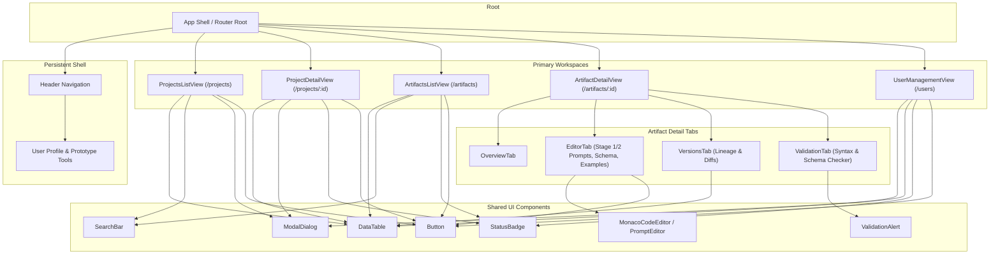

# Proposed Application Architecture Map

*Note: This diagram represents the proposed route, workspace, and component architecture for the Artifact Dashboard prototype.*

## Workspace Descriptions

1. **`ProjectsListView` (`/` or `/projects`)**: Catalog of active and archived projects with quick metrics on linked artifacts.
2. **`ProjectDetailView` (`/projects/:id`)**: Project dashboard showing attached artifacts, member assignments, and project actions (Attach / Detach / Create Artifact).
3. **`ArtifactsListView` (`/artifacts`)**: Global library of all multi-stage prompt & schema artifacts across all projects with search and filter capabilities.
4. **`ArtifactDetailView` (`/artifacts/:id`)**: Multi-tab workspace for artifact authoring and inspection:
   - **Overview**: Metadata, ownership, publish state.
   - **Editor**: Stage 1 Extraction Prompt, Stage 2 Refinement Prompt, JSON Schema, and Few-Shot examples.
   - **Versions**: Immutable version history, changelogs, and rollback options.
   - **Validation**: Real-time evaluation of syntax, JSON validity, and schema conformance.
5. **`UserManagementView` (`/users`)**: Administrator console for managing team members, roles, project assignments, and user statuses.
