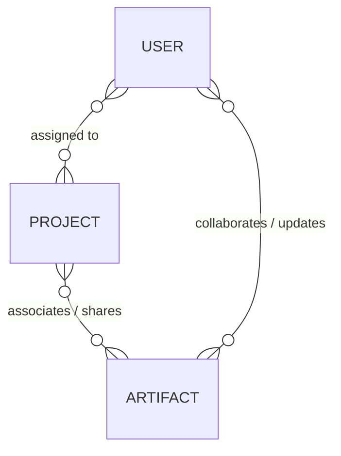
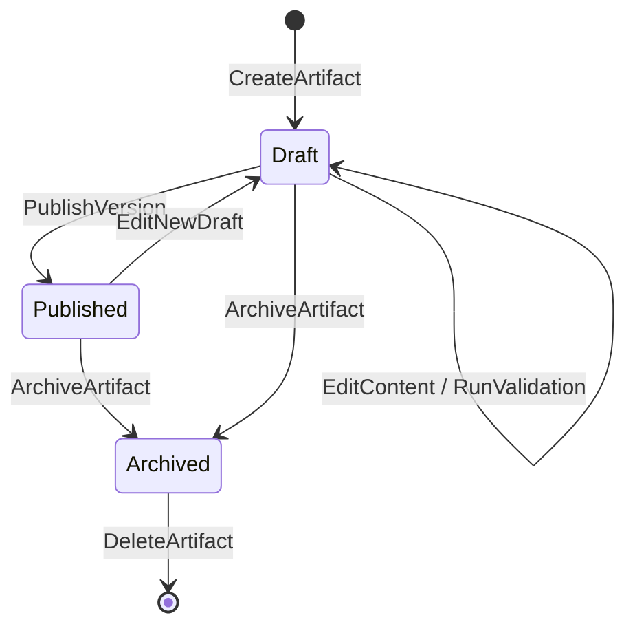

# OOUX Object Map & Feature Specification

## 1. Domain Object Inventory

| Object Name | Description | Key Roles / Owners | Primary Surface / View |
|---|---|---|---|
| **Project** | Workspace container grouping related artifacts and team members | Project Contributor / Developer, Admin | `ProjectsListView`, `ProjectDetailView` |
| **Artifact** | Central asset containing multi-stage extraction/refinement prompts, JSON schema, few-shot examples, and version history | Artifact Author / Prompt Engineer | `ArtifactDetailView` (*Overview, Editor, Versions, Validation*) |
| **User** | System user with assigned roles, project associations, and access state | Admin | `UserManagementView` |

---

## 2. Object Relationship Matrix



| Source Object | Target Object | Cardinality | Relationship Description |
|---|---|---|---|
| `Project` | `Artifact` | Many-to-Many (`}o--o{`) | A Project links to 0..* Artifacts; an Artifact can be shared across 0..* Projects |
| `User` | `Project` | Many-to-Many (`}o--o{`) | A User is assigned to 0..* Projects; a Project has 1..* assigned Users |
| `User` | `Artifact` | Many-to-Many (`}o--o{`) | Users author, contribute to, validate, and publish Artifact versions |

---

## 3. Calls to Action (CTA) & State Machine

### Object: `Artifact`



| State | Available CTAs | Actor Role | Next State | System Side Effects |
|---|---|---|---|---|
| *Any* | `CreateArtifact` | Author, Admin | `Draft` | Generate unique ID, set initial version (`v0.1.0-draft`), assign author |
| `Draft` | `EditContent` | Author | `Draft` | Save Stage 1/2 prompts, JSON Schema, and few-shot JSON array |
| `Draft` | `RunValidation` | Author | `Draft` | Execute client/server validation; update transient `validationState` |
| `Draft` | `PublishVersion` | Author, Admin | `Published` | Lock immutable snapshot in `versions[]`, bump version (e.g. `v1.0.0`), record timestamp |
| `Published` | `EditNewDraft` | Author | `Draft` | Branch new working draft while preserving current active published version |
| `Published` / `Draft` | `RevertToVersion` | Author, Admin | `Draft` | Restore previous version snapshot into active editor |
| `Published` / `Draft` | `LinkToProject` | Developer, Author | *Unchanged* | Add project reference to `projectIds[]` and artifact to project |
| `Published` / `Draft` | `UnlinkFromProject` | Developer, Author | *Unchanged* | Remove project reference from `projectIds[]` |
| `Published` / `Draft` | `ArchiveArtifact` | Author, Admin | `Archived` | Mark read-only; hide from active project picker |
| `Archived` | `DeleteArtifact` | Admin | *Deleted* | Permanently remove record and unbind from all projects |

---

### Object: `Project`

| State | Available CTAs | Actor Role | Next State | System Side Effects |
|---|---|---|---|---|
| *Any* | `CreateProject` | Developer, Admin | `Active` | Initialize name, description, and created timestamp |
| `Active` | `EditProject` | Developer, Admin | `Active` | Update project title and description |
| `Active` | `AttachArtifacts` | Developer, Admin | `Active` | Link selected artifacts; update reciprocal `projectIds` |
| `Active` | `DetachArtifacts` | Developer, Admin | `Active` | Unlink artifacts from project list |
| `Active` | `ArchiveProject` | Admin | `Archived` | Mark project read-only |
| `Archived` | `DeleteProject` | Admin | *Deleted* | Delete project container; detached shared artifacts remain intact |

---

### Object: `User`

| State | Available CTAs | Actor Role | Next State | System Side Effects |
|---|---|---|---|---|
| *Any* | `CreateUser` | Admin | `Active` | Send invite, assign roles and project access |
| `Active` | `ChangeRole` | Admin | `Active` | Update permissions (`Admin`, `Author`, `Developer`) |
| `Active` | `ChangeProjects` | Admin | `Active` | Update assigned `projectIds` |
| `Active` | `DisableUser` | Admin | `Disabled` | Revoke session; block login access |
| `Disabled` | `EnableUser` | Admin | `Active` | Restore account access |
| `Disabled` | `DeleteUser` | Admin | *Deleted* | Permanently purge user; preserve audit author names in historical logs |

---

## 4. TypeScript Interface Blueprint (`shared/types.ts`)

```typescript
export type ArtifactStatus = 'draft' | 'published' | 'archived';
export type ProjectStatus = 'active' | 'archived';
export type UserRole = 'admin' | 'author' | 'developer';
export type UserStatus = 'active' | 'disabled';

export interface UserSummary {
  id: string;
  name: string;
  email: string;
}

export interface ArtifactVersionSnapshot {
  version: string;
  stage1Prompt: string;
  stage2Prompt: string;
  jsonSchema: string;
  fewShotExamples: Record<string, any>[];
  publishedAt: string;
  publishedBy: UserSummary;
  changelog?: string;
}

export interface ValidationErrorItem {
  field: 'stage1Prompt' | 'stage2Prompt' | 'jsonSchema' | 'fewShotExamples';
  line?: number;
  message: string;
  severity: 'error' | 'warning';
}

export interface ValidationState {
  isValid: boolean;
  errors: ValidationErrorItem[];
  warnings: string[];
  lastValidatedAt?: string;
}

export interface Artifact {
  id: string;
  name: string;
  description: string;
  status: ArtifactStatus;
  currentVersion: string;
  projectIds: string[];
  
  // 4-Tab Contents
  // 1. Overview Metadata
  createdAt: string;
  createdBy: UserSummary;
  updatedAt: string;
  updatedBy: UserSummary;
  
  // 2. Editor State
  stage1Prompt: string; // Extraction prompt (markdown/plaintext)
  stage2Prompt: string; // Refinement/normalization prompt (markdown/plaintext)
  jsonSchema: string;   // JSON schema definition string
  fewShotExamples: Record<string, any>[]; // JSON array
  
  // 3. Versions History
  versions: ArtifactVersionSnapshot[];
  
  // 4. Computed / Transient Validation
  validationState?: ValidationState;
}

export interface Project {
  id: string;
  name: string;
  description: string;
  status: ProjectStatus;
  artifactIds: string[];
  userIds: string[];
  createdAt: string;
  updatedAt: string;
}

export interface User {
  id: string;
  email: string;
  name: string;
  roles: UserRole[];
  projectIds: string[];
  status: UserStatus;
  createdAt: string;
  lastLoginAt?: string;
}
```
